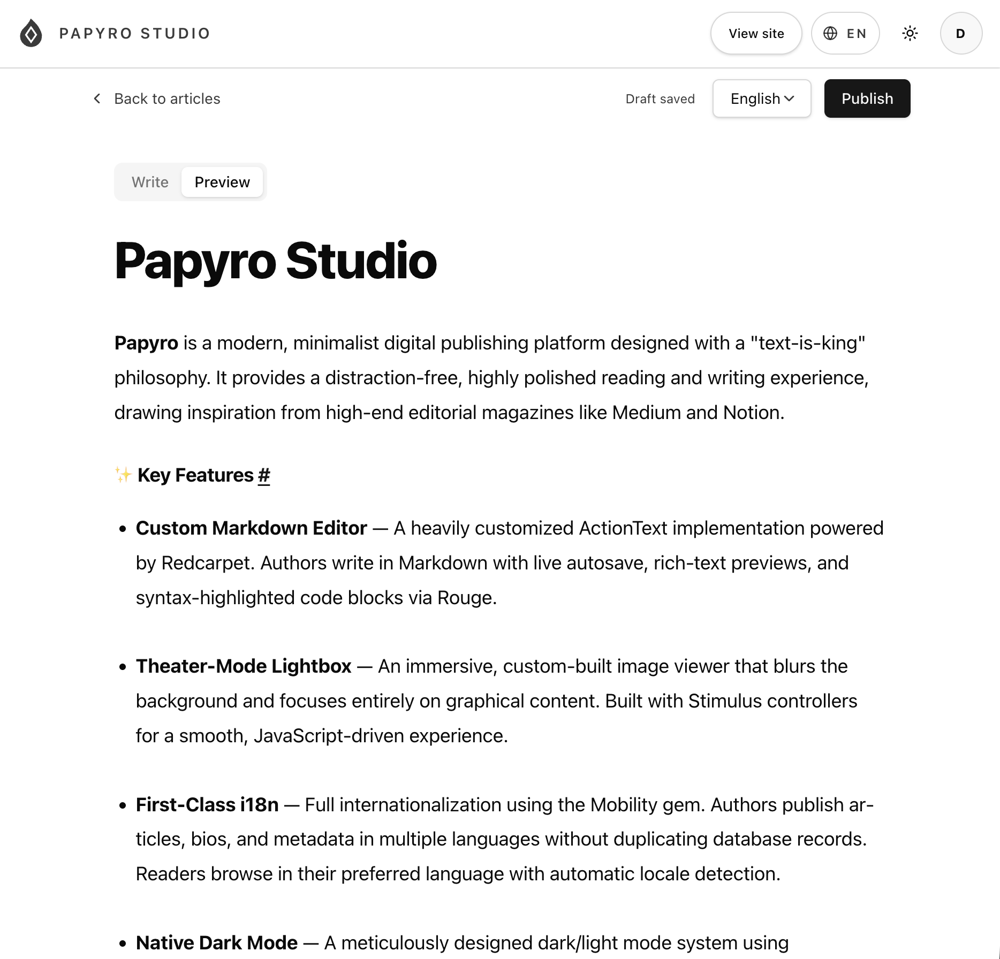

# 🖋️ Papyro

> **A serene editorial space for ideas.**


Papyro is a modern, minimalist digital publishing platform designed with a "text-is-king" philosophy. It provides a distraction-free, highly polished reading and writing experience, drawing inspiration from high-end editorial magazines like Medium and Notion.


*Light and dark modes adapt seamlessly to user preferences.*

---

## ℹ️ Repository Status & Architectural Note

**Welcome!** This repository is made public for peer review, educational purposes, and to showcase the software architecture, code quality, and UI/UX implementation behind Papyro.

Please note that Papyro is a **proprietary, commercial product**, not an Open Source project. Furthermore, this repository contains the **Main Public Application**, but it depends heavily on a private Rails Engine (`papyro_studio`) which encapsulates the core authoring and publishing business logic. 

To protect intellectual property, this private engine is not included. As a result, **this project cannot be cloned and booted out-of-the-box.** However, you are highly encouraged to explore the codebase to see real-world implementations of: Hotwire patterns, custom ActionText/Redcarpet Markdown rendering, multi-tenant subdomain routing, i18n with Mobility, Phlex component design, and Tailwind CSS theming!

---

## ✨ Key Features

- **Custom Markdown Editor** — A heavily customized ActionText implementation powered by Redcarpet. Authors write in Markdown with live autosave, rich-text previews, and syntax-highlighted code blocks via Rouge.

- **Theater-Mode Lightbox** — An immersive, custom-built image viewer that blurs the background and focuses entirely on graphical content. Built with Stimulus controllers for a smooth, JavaScript-driven experience.

- **First-Class i18n** — Full internationalization using the Mobility gem. Authors publish articles, bios, and metadata in multiple languages without duplicating database records. Readers browse in their preferred language with automatic locale detection.

- **Native Dark Mode** — A meticulously designed dark/light mode system using Tailwind CSS variables. Maintains WCAG contrast standards with special attention to colorblind accessibility.

- **Subdomain Architecture** — Clean separation of concerns: the discovery and reading experience lives at `papyro.net`, while the authoring dashboard and studio tools run on `studio.papyro.net`.

- **Google OAuth Authentication** — Secure sign-in via Google OAuth2 with CSRF protection. User profiles with multilingual bios and avatars.

- **SEO-Optimized** — Per-article canonical URLs, hreflang tags, Open Graph metadata, Twitter Cards, and JSON-LD structured data — all locale-aware.

- **Solid Stack** — Background jobs via Solid Queue, caching via Solid Cache, and WebSocket support via Solid Cable — all running on SQLite with zero external service dependencies.

---

## 🛠 Tech Stack

| Layer | Technology |
|---|---|
| **Language** | Ruby 4.0 |
| **Framework** | Ruby on Rails 8.1 |
| **Frontend** | Hotwire (Turbo + Stimulus), Tailwind CSS, Phlex |
| **Markdown** | Redcarpet with Rouge syntax highlighting |
| **Database** | SQLite3 (development), SQLite with persistent volume (production) |
| **Authentication** | Google OAuth2 (omniauth-google-oauth2) |
| **i18n** | Mobility gem with friendly_id-mobility for translated slugs |
| **File Storage** | Active Storage with image_processing (ImageMagick/libvips) |
| **Background Jobs** | Solid Queue |
| **Caching** | Solid Cache |
| **WebSockets** | Solid Cable |
| **Authorization** | Pundit |
| **Pagination** | Pagy |
| **Routing** | route_translator for localized URLs |
| **Testing** | Minitest, Capybara, Cuprite (system tests) |
| **Linting** | RuboCop (rubocop-rails-omakase), Brakeman, bundler-audit |
| **Deployment** | Docker + Kamal 2, GitHub Container Registry |

---

## 🏗 Architecture

Papyro follows a **modular subdomain architecture** inspired by 37signals' patterns:

```
papyro.net          →  Main Rails app serving the public discovery,
                        article reading, and author profile pages.

studio.papyro.net   →  Private Rails Engine (papyro_studio) mounted
                        as a subdomain, providing the full authoring
                        dashboard: article editor, publishing workflow,
                        and analytics.
```

Both applications share the same database and authentication session (cookie domain: `.papyro.net`). The engine is loaded via a Git-backed gem in the Gemfile, allowing independent versioning while sharing models, policies, and infrastructure.

```
papyro/
├── app/
│   ├── concepts/      # Domain operations, contracts, presenters
│   ├── controllers/   # Public-facing controllers
│   ├── helpers/       # SEO helpers, UI helpers
│   ├── models/        # Shared models (Article, User, etc.)
│   └── views/         # Phlex components & layouts
├── config/
│   ├── deploy.yml     # Kamal 2 deployment config
│   └── routes.rb      # Subdomain-constrained routing
├── lib/
│   ├── markdown_renderer.rb  # Custom Redcarpet renderer
│   └── tasks/                # Rake tasks (test suites, CI)
└── test/               # Minitest suite (unit, integration, system)
```

---

## 🚀 Getting Started

### Prerequisites

- **Ruby 4.0.0** — Install via `rbenv`, `asdf`, or `ruby-install`
- **Bundler** — `gem install bundler`
- **SQLite3** — `brew install sqlite` (macOS) or `apt install sqlite3` (Linux)
- **libvips** or **ImageMagick** — For Active Storage image processing
- **Git** — For cloning the repository

### ⚠️ Important: Private Engine Dependency

This repo depends on `papyro_studio`, a private Rails Engine hosted in a separate GitHub repository. You will not be able to run the full application without access to this engine. This repository is intended for **code review and portfolio evaluation**.

### Installation (for code review)

```bash
# Clone the repository
git clone https://github.com/doncan-orozco/papyro.git
cd papyro

# Install dependencies
bundle install

# Set up environment variables
cp .env.example .env

# Set up the database
bin/rails db:prepare

# (Optional) Seed data for exploration
bin/rails db:seed
```

### Running (requires papyro_studio access)

```bash
# Start the development server with Tailwind CSS watcher
bin/dev

# Or start components individually:
bin/rails server       # Rails on http://localhost:3030
bin/rails tailwindcss:watch  # CSS compilation

# Run the test suite
bin/rails test:all_with_studio
```

### Available Development Commands

| Command | Purpose |
|---|---|
| `bin/dev` | Start Rails server + Tailwind watcher |
| `bin/rails test` | Run core test suite |
| `bin/rails test:all_with_studio` | Run core + studio tests |
| `bin/rubocop` | Lint Ruby files |
| `bin/bundler-audit` | Check gems for CVEs |
| `bin/brakeman` | Static security analysis |

---

## 🚢 Deployment

Papyro is deployed to a cloud server using **Kamal 2** with zero-downtime rolling deployments:

```yaml
# config/deploy.yml (excerpt)
service: papyro
image: doncan-orozco/papyro
servers:
  web:
    - 163.192.128.99
proxy:
  ssl: true
  hosts:
    - papyro.net
    - studio.papyro.net
registry:
  server: ghcr.io
volumes:
  - "papyro_storage:/rails/storage"
```

- **Container Registry:** GitHub Container Registry (`ghcr.io`)
- **SSL:** Automatic via Let's Encrypt through Kamal's built-in proxy
- **Storage:** Persistent Docker volume for SQLite database and Active Storage uploads
- **Architecture:** ARM64 builds, single-server deployment with Puma web server and Solid Queue running in-process

```bash
# Deploy to production
kamal deploy

# View logs
kamal logs

# Open a Rails console
kamal console
```

---

## 🤝 Contributing

Papyro is proprietary software and does not accept public contributions. However, if you are exploring the codebase for learning or peer review and have questions about the architecture:

1. Open a [GitHub Discussion](https://github.com/doncan-orozco/papyro/discussions) for questions.
2. Feel free to fork the repository for personal code review and learning.
3. Respect the [Code of Conduct](CODE_OF_CONDUCT.md) in all interactions.

---

## 📄 License

Copyright © 2026 **Doncan Orozco**. All Rights Reserved.

This is proprietary software. The source code is made available publicly on GitHub strictly for **educational review, peer feedback, and portfolio demonstration**. See the [LICENSE](LICENSE) file for full terms.

No license is granted to use, copy, modify, distribute, or deploy this software.

---

## 📫 Contact

**Doncan Orozco** — Senior Ruby on Rails Developer

- 💼 [LinkedIn](https://linkedin.com/in/doncan-orozco)
- 🐙 [GitHub](https://github.com/doncan-orozco)

---

*Built with ❤️ and Ruby.*
